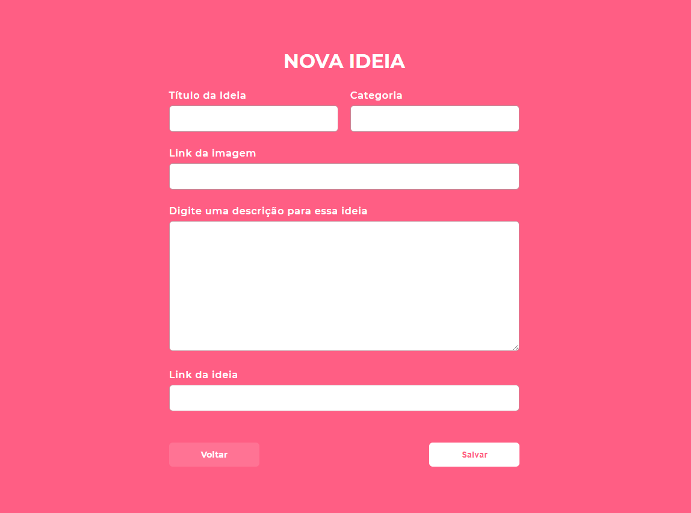

# WorkshopDev da Semana OmniStack 11.0

## Projeto desenvolvido: Casa Criativa - Ideias para a crise

Workshop para quem está iniciando no desenvolvimento web, paralelo ao projeto principal da Semana OmniStack, ele aborda os fundamentos do desenvolvimento web como HTML, CSS, Javascript e SQL.

## Anotações das aulas

### Dia 1

#### Introdução à programação web:
* O que é programação?
    * Ensinar o computador.
        * Algoritmos.
            * Passo a passo.
            * Conjunto de regras.
        * Lógica de Programação.
            * Maneira de pensar.
        * Sintaxe.
            * Maneira correta de escrever.
* Qual linguagem de programação?
    * Javascript.

#### Ambiente de desenvolvimento:
- [x] Instalar o VSCode.
- [x] Instalar o Node.js.
    * Baseado no Chrome V8 Javascript engine.
    - [x] Instalar o Liver Server plugin.
- [x] Instalar o Google Chrome.

#### Front-end e Back-end:
* Imagine que...você está em uma farmácia e pede ao farmaceutico um remédio e ele vai lá atrás e busca no estoque o medicamento. No caso o cliente é o Front-end (cliente) e o farmaceutico o Back-end (servidor).
    * Quem chama é o cliente, quem escuta e responde é o servidor.

* Como é feita a comunicação?
    * HTTP - HyperText Transfer Protocol.
    * URL.
    * Troca de dados.

* Tecnologias.
    * Front-end:
        * HTML.
        * CSS.
        * Javascript.

#### Propostas do Dia 1:
- [x] Apresentação do projeto.
    * Casa Criativa - Ideias para a crise.
        * Cadastro de ideias, brincadeiras, cursos, dicas...
        * Telas do projeto:
            * Tela inicial com a descrição do projeto e últimas ideias cadastradas.
            * Tela de cadastro.
            * Tela de exibição de todas ideias.
- [x] Introdução ao HTML + CSS + JS.
    * HTML - Estrututa.
    * CSS - Estilo.
    * Javascript - Inteligência.

### Dia 2

#### Propostas do Dia 2:
- [x] Refatorar o código:
    * Separar os códigos de CSS e Javascript do HTML.
- [x] Aperfeiçoar a página inicial.
    
- [x] Apresentar o formulário de cadastro de ideias
    

### Dia 3

#### Propostas do Dia 3:
* Revisar os conteúdos já abordados.
- [x] Criar a página de exibição de todas idéias cadastradas.
    

### Dia 4

#### Back-end:
* Responsabilidades:
    * Receber pedidos do cliente.
        * Pesquisar uma página no buscador, o servidor entrega ao cliente.
    * Devolver resposta.
    * Regras de negócio.
        * Validação de CPF, se é válido, se não está cadastrado ainda...
    * Dados.
        * Tratamento de dados, limpar os dados e ter persistencia.
* Tecnologias utilizadas:
    * Node.js
    * Banco de dados.

#### Propostas do Dia 4:
* Revisar os conteúdos já abordados.
* Configurar o servidor com express e nunjucks.
* Refatorar os arquivos index.html e ideas.html.

### Dia 5

#### Back-end:
* Banco de dados:
    * Dados não podem ficar na aplicação.
    * Perder / Corromper.
    * Segurança.
    * Responsabilidades.
* SQL:
    * Structured Query Language.
    * Linguagem para consultar, criar, atualizar, listar, deletar e muito mais...
    * Tabelas / Entidades / Relações - Colunas e linhas.
* Tecnologia utilizada:
    * SQLite.
    * SQLite é open-source, não precisa de um mundo de configurações, é estruturado para ser um banco de dados relacional que reside na própria aplicação.
    * PERFEITO para quem está começando no mundo SQL.

#### Propostas do Dia 5:
* Criar e configurar o banco de dados.

#### Propostar de implementações extras:
- [ ] Implementar deletar idéia.
- [ ] Validação de dados no Back-end.

